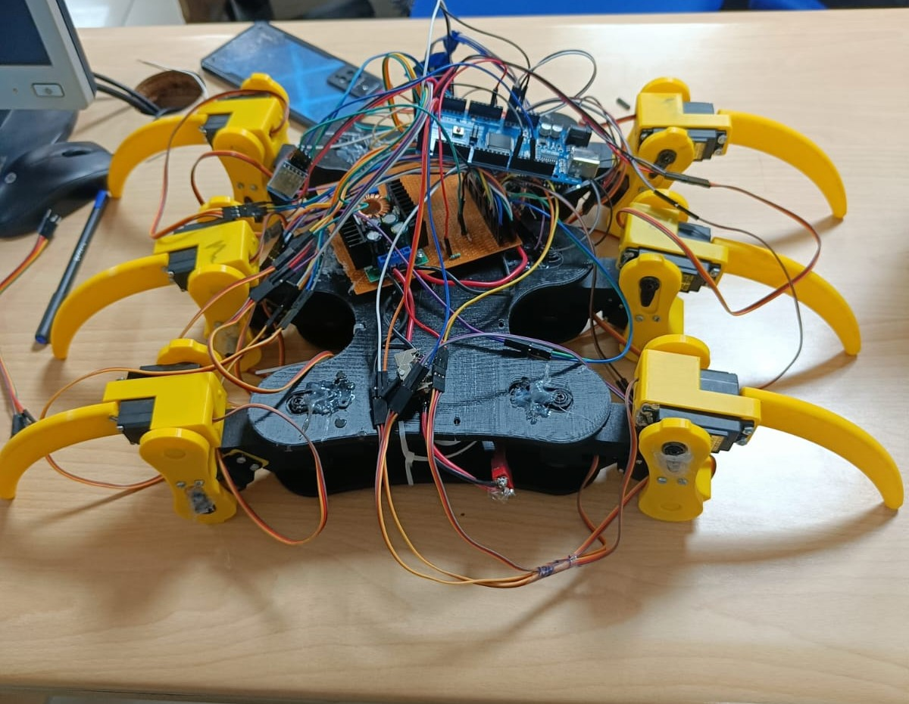
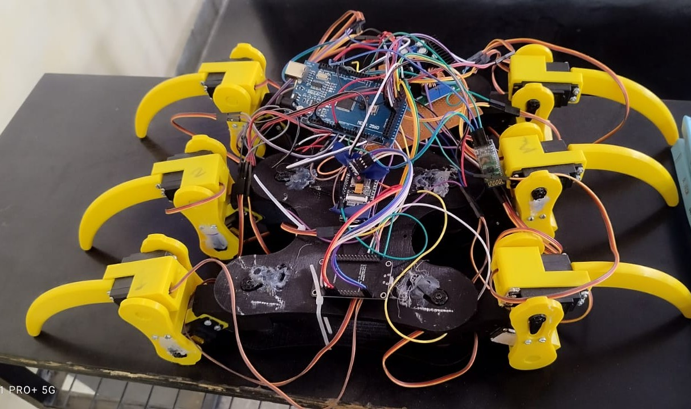

# RECON (Responsive Earthquake Conditions Operations Navigator) 🕷️🤖  
*A Six-Legged Spider Bot for Disaster Search & Rescue*

## 🚀 Project Overview
In disaster situations like earthquakes, **time is critical** when it comes to saving lives. Traditional wheeled robots often fail to navigate debris-filled environments. To solve this, I present **RECON**, a six-legged spider robot (hexapod) designed to assist in **search and rescue operations** with precision and adaptability.

This project was completed as part of my Final Year Engineering curriculum and serves as a practical demonstration of how robotics, AI, and IoT can work together to aid humanity in times of crisis.

---

## 🔍 Key Features

### ✅ Autonomous Hexapod Locomotion
- Powered by **12 MG996R servo motors**
- Controlled via **Arduino Mega 2560**
- Implements a **Hexapod Gait Algorithm** for stable movement over rough and unstable terrain

### ✅ Thermal Human Detection
- Uses **MLX90614 IR temperature sensor** to detect living beings based on thermal signature
- Can detect survivors even in **dark, dusty, or smoke-filled** environments

### ✅ Real-Time Image Processing via YOLOv5
- Onboard **ESP32-CAM** streams video over WiFi
- A **Flask-based server** receives the stream and runs **YOLOv5** object detection to confirm if the thermal signature is a human
- Ensures minimal **false positives**

### ✅ GPS Location Transmission
- **NEO-6M GPS module** fetches current location coordinates
- **ESP8266 WiFi module** sends detected survivor's location to a web dashboard/server or mobile device via IoT protocols

### ✅ Smartphone Controller App
- Developed using **MIT App Inventor**
- Allows remote control of the robot’s movement, live video feed, and emergency stop
- Real-time display of GPS coordinates and detection status

---

## 🛠️ Technologies Used

| Technology       | Purpose                          |
|------------------|-----------------------------------|
| Arduino Mega     | Central servo and leg control     |
| ESP32-CAM        | Video stream & image processing   |
| ESP8266          | IoT communication (WiFi-based)    |
| MLX90614         | Thermal human presence detection  |
| NEO-6M GPS       | Geolocation tracking              |
| Flask + YOLOv5   | Object detection server           |
| MIT App Inventor | Mobile app for remote control     |
| Servo motors     | Hexapod mobility                  |

---

## 🧠 YOLOv5 Model Integration
- Flask server hosted on a laptop or cloud VM
- Accepts live video stream from ESP32-CAM
- Detects **"person"** label via YOLOv5
- Returns either:
  - `"face_detected"` (with GPS)
  - `"no_face"`

---

## 📍 Real-Time GPS Sharing
When a human is detected, the robot:
1. Captures current GPS coordinates
2. Sends data via ESP8266 to server/mobile
3. Marks location for rescue team

---

## 🌟 Impact

RECON showcases how **robotics + deep learning + IoT** can significantly improve rescue operations by quickly identifying and geolocating trapped survivors—without risking human lives. This is a strong example of **engineering for social good**.

---

## 📸 Robot Images

|  |  |
|:--:|:--:|

---

## 📦 Folder Structure (Recommended for GitHub)
```
RECON_Robot_Project/
├── .gitmodules/
├── .git/
├── yolov5/
├── ESP32_CAM/
│ └── esp32_cam_yolo.ino
├── ESP8266-IR-Sensor/
│ └── esp8266_ir_temp.ino
├── Flask-YOLO-server/
│ ├── server.py
├── Arduino-Mega-Motion/
│ └── mega_leg_controller.ino
├── Media/
│ ├── Image_1.jpeg
│ └── Image_2.jpeg
├── README.md
```

---

---

## 📥 Cloning with Submodules

To clone this repository and initialize all required submodules (e.g., YOLOv5):

```bash
git clone --recurse-submodules https://github.com/VartikaChauhan/RECON_Robot_Project.git
// Already cloned without submodules? Use:
git submodule update --init --recursive
```
